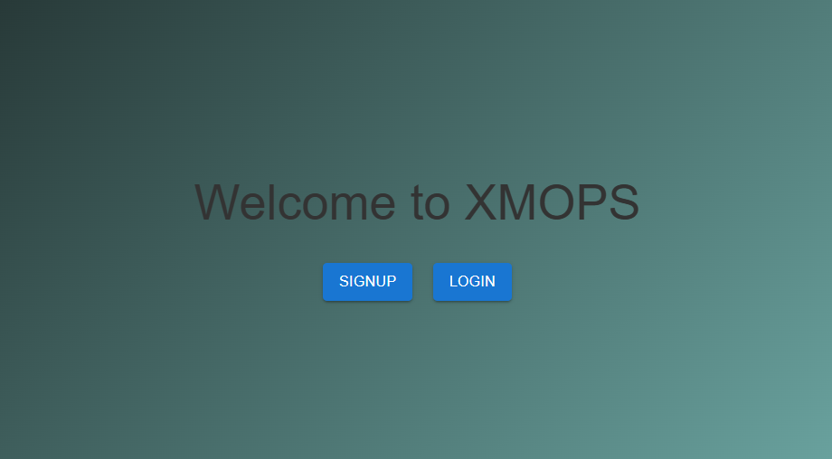

# XMOP: Centralized Control Plane for Infrastructure Management



## Table of Contents
- [Introduction](#introduction)
- [Installation](#installation)
  - [Dependencies](#dependencies)
  - [Instructions](#instructions)
- [Architecture](#architecture)
  - [XMOP Architecture](#xmop-architecture)
  - [Deployment Architecture with Terraform](#deployment-architecture-with-terraform)
  - [Networking Module](#networking-module)
  - [Instances Module](#instances-module)
  - [Security Module](#security-module)
- [Guides for Common Tasks](#guides-for-common-tasks)
- [Tips and Best Practices](#tips-and-best-practices)
- [Hosting on EC2 with pm2](#hosting-on-ec2-with-pm2)
- [API Documentation](#api-documentation)
- [Troubleshooting Steps and Solutions](#troubleshooting-steps-and-solutions)
- [Reflection](#reflection)

---

## Introduction

XMOP is a centralized control plane designed to streamline and accelerate redundant tasks. It serves as a platform for managing various operations related to infrastructure provisioning and deployment on AWS. XMOP enhances efficiency, security, and scalability by providing automated solutions and centralized control over deployment processes.

Key features of XMOP include:
- **Secure Authentication**: Multi-factor authentication using Amazon Cognito.
- **Efficient Infrastructure Deployment**: Automates the deployment of infrastructure components using Terraform.
- **User-Friendly Front-End**: Provides an intuitive interface for managing deployments, including dashboards and history tracking.
- **Workspace Feature**: Allows users to manage deployments across different workspaces for collaboration and multi-user environments.
- **Monitoring interface**: Allows users to monitor metrics of each deployments on AWS.

---

## Installation

### Dependencies:
- AWS credentials with necessary permissions set in .env file.
- Node.js and npm installed.
- Terraform installed.

### Instructions:
1. Clone the repository:
   ```bash
   git clone https://github.com/taynguyen3110/XMOP
2. Install dependencies:
   ```bash
   npm install
3. Navigate to the /backend directory and start the server:
   ```bash
   cd backend
   node server.js
4. Ensure you're not using incognito mode in your browser and leave the XMOP tab open during deployments for proper logging.

## Architecture

### XMOP Architecture

XMOP integrates with AWS Cognito for user authentication and uses two databases:

- Workspaces Database: Stores workspace information, including status and deployment details.
- Deployments Database: Tracks individual deployment details, such as deployment ID, workspace, deployment time, and status.

### Deployment Architecture with Terraform

XMOP uses a highly available and scalable AWS architecture to deploy WordPress applications. It spans multiple availability zones to ensure fault tolerance.

### Networking Module:
- VPC: Isolates and segments resources.
- Internet Gateway: Enables internet access for the VPC.
- Availability Zones (AZs): Enhance fault tolerance.
- Subnets: Public and private subnets for different resource types.

### Instances Module:
- Bastion Instance: Secure gateway for administrators to access private instances.
- Application Load Balancer (ALB): Distributes traffic across EC2 instances.
- WordPress EC2 Instances: Hosted within private subnets and managed by Auto Scaling groups.
- Amazon RDS & EFS: Provide scalable database and file storage solutions.

### Security Module:
- Security groups are defined to control access to instances, load balancers, and databases.

## Guides for Common Tasks

### Workspace Management:

- Use the navigation bar to select a workspace and manage deployments.
- Workspaces need unique names (lowercase alphanumeric characters and hyphens only).
- The deployment form is used for managing deployments within the selected workspace.

### Deployment Process:

- After selecting a workspace, the form data is sent to deploy the infrastructure via Terraform.
- Confirmation boxes show the Terraform plan and initiate the deployment process.
- The monitoring page will display deployment logs and resource counts once complete.

## Tips and Best Practices:

- Do not use incognito mode or multiple sessions in the same browser.
- Keep track of workspaces and deployments using the provided tools in the interface.
  
## API Documentation

### General APIs

- **`getRegion`**  
  Retrieves available AWS regions using the AWS SDK.

- **`getExistKey`**  
  Returns all key pairs available in the specified region.

- **`createKey`**  
  Creates a new key pair in the given region, generates a private key in `.pem` format, and allows the user to download it.

- **`importKey`**  
  Reads the uploaded public key content and imports the public key to the specified region.

- **`getEngineVer`**  
  Queries AWS RDS to fetch available engine versions based on the provided engine type and responds with the retrieved versions.

---

### Backend APIs

#### `deployAWS`

This API provides several endpoints for running Terraform commands:

- **`/init`**  
  Initializes Terraform in a specified workspace.

- **`/plan`**  
  Writes the form data to a `.tfvars` file and generates a Terraform plan based on the submitted form data.

- **`/apply`**  
  Applies the generated Terraform plan.

- **`/destroy-plan`**  
  Generates a plan to destroy existing resources.

- **`/confirm-destroy`**  
  Approves and executes the destruction of resources.

Each endpoint utilizes a function to save command outputs to `stdout` and `stderr` log files within the workspace directory.

#### `checkState`

Checks the state file of the current workspace to determine if any resources have been deployed.  
- Returns `true` if there is no deployment in the workspace and `false` otherwise.

#### `logDeploy`

Endpoint: `/log-deploy`  
Logs deployment information to a JSON file.  
- It reads existing deployment data from `../src/deployment.json`, updates it with the provided deployment details, and writes back the updated data to the file.  
- Includes a function `updateOngoingDeploy` that updates ongoing deployment status in `workspaces.json` based on workspace and region information.  
- This API is called twice:
  1. When the deployment is applied.
  2. When the deployment is destroyed to update `deployment.json` and `workspaces.json`.

#### `workspaces`

Defines routes for managing workspaces:  
- **Create**: Generates a unique ID, creates a directory for the workspace, and copies the Terraform folder into it.  
- **Retrieve**: Returns a list of all existing workspaces.  
- **Get Details**: Returns detailed information for a specific workspace.  
- **Delete**: Removes the workspace directory and updates the list of workspaces accordingly.

#### `openFile`

Reads the `stdout` and `stderr` log files and returns their content for display on the frontend.

#### `getResources`

Returns the number of resources deployed in a given workspace.

#### `getResourceARN`

Returns the ARN suffix, DNS name of the load balancer, and ARN suffix of the target group for deployed resources.

#### `getMetricData`

Receives the ARN suffix of the load balancer and target group, then returns metrics data to be displayed on the frontend.


## Troubleshooting Steps and Solutions:

- Ensure that you remain on the XMOP tab during deployment to ensure logs are updated properly.
- If deployment fails, check the stderr.txt log file in your workspace directory.
- For Terraform errors, consult the error logs to identify the issue and make necessary adjustments.
